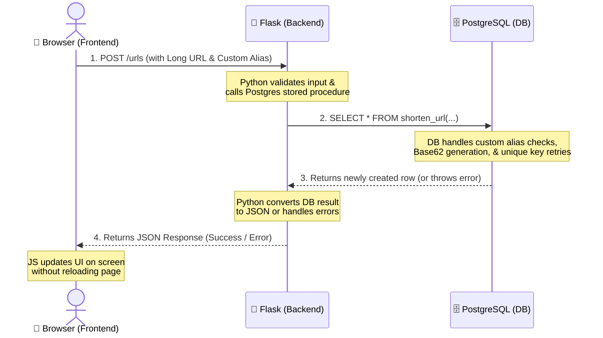
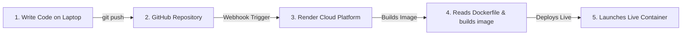

# 📖 The Architect's Guide to SnapURL: From Code to Cloud

This guide explains the complete architecture, connectivity, and deployment lifecycle of **SnapURL**. It is written to give you a deep, simple, and comprehensive understanding of how the frontend, backend, database, Docker, GitHub, and Render work together.

---

## ⚡ Quick Answers (Crucial Concepts)

### 1. Does my laptop or local database need to be running for the website to work?
**No.** Once deployed, the application and database run 24/7 on **Render's cloud servers**. 
* You can shut down your laptop, close your terminal, or turn off your local Postgres app.
* Anyone in the world can still visit your live site and shorten URLs because the servers executing the code and storing the links live in Render's data centers, not on your computer.

### 2. Is this deployment free or are we paying by the hour/day?
**It is 100% Free**, but since it is on Render's free tier, there are two important behaviors to know:
* **The "Sleep" Cycle (Spin Down)**: If your web app doesn't receive any visitors for 15 minutes, Render puts the web container to "sleep" to save resource costs. The next time someone visits your link, they will experience a **50-second delay** while Render wakes the container back up. Subsequent visits will be instant.
* **Database Lifetime**: Render's free PostgreSQL databases expire automatically **90 days** after creation. For a permanent production database, one would upgrade to Render's starter tier ($7/month).

---

## 🏗️ 1. The Three-Tier Architecture

SnapURL is built as a classic **Three-Tier Web Application**:



### The Parts:
1. **Frontend (User Interface)**: Built using HTML, CSS (featuring a glowing Glassmorphism card), and native JavaScript. It runs entirely inside the **visitor's web browser**.
2. **Backend (Application Logic)**: A lightweight Python web server using **Flask**. It listens for HTTP requests, validates incoming inputs, talks to the database, and returns JSON data or HTML pages.
3. **Database (Data & Core Logic)**: A **PostgreSQL** instance. Uniquely, **the core shortening logic resides inside the database** as PL/pgSQL stored procedures rather than in Python.

---

## 🔌 2. How the Backend and Database Connect

The connection between your Python backend ([app.py](file:///Users/abhinovreddy0114/Documents/url_shortner/app.py)) and PostgreSQL ([init.sql](file:///Users/abhinovreddy0114/Documents/url_shortner/init.sql)) is managed using two key components:

### The Database Driver: `psycopg2`
Python cannot natively talk to PostgreSQL. We use a library called `psycopg2-binary` (listed in [requirements.txt](file:///Users/abhinovreddy0114/Documents/url_shortner/requirements.txt)) which translates Python commands into SQL commands that PostgreSQL understands.

### Connection Pooling
Instead of opening and closing a database connection on every single click (which is slow and wastes resources), we initialize a `SimpleConnectionPool` in [app.py](file:///Users/abhinovreddy0114/Documents/url_shortner/app.py#L19-L26). It keeps a pool of active database connections open and ready to use.

### Environment Variables (The Key to Portability)
Instead of hardcoding database passwords and hosts directly in the code, the Python script reads them from system environment variables:
```python
DB_HOST = os.environ.get("DB_HOST", "localhost")
DB_PORT = os.environ.get("DB_PORT", "5432")
DB_NAME = os.environ.get("DB_NAME", "url_shortener")
DB_USER = os.environ.get("DB_USER", "postgres")
DB_PASSWORD = os.environ.get("DB_PASSWORD", "")
```
This environment-driven design makes the app fully portable:
* **Locally**: The variables fall back to `localhost` and your local machine username.
* **In Docker Compose**: [docker-compose.yml](file:///Users/abhinovreddy0114/Documents/url_shortner/docker-compose.yml#L20-L25) overrides these variables to point to the local Docker database container (`db`).
* **On Render**: Render's network automatically injects its production database host, username, and password directly into the environment variables.

---

## 🐳 3. What is Docker & How Does it Connect with GitHub and Render?

### What is Docker?
Think of Docker as a **virtual shipping container**. 
* Locally, your computer has specific versions of Python, packages, and OS libraries. If you move your code to another server, it might break because that server has a different Python version or is missing a library.
* A [Dockerfile](file:///Users/abhinovreddy0114/Documents/url_shortner/Dockerfile) tells Docker how to build a miniature, self-contained Linux operating system containing exactly what the app needs (Python 3.12, Flask, psycopg2-binary, and our project files).
* A running instance of this image is called a **Container**.

### Do I need Docker Desktop running on my laptop for this to work in production?
**No.** You only need Docker Desktop if you want to run the containerized app locally. For production deployment, **Render's servers build and run the Docker container for you**.

### The GitHub ➡️ Render Deployment Pipeline



1. **GitHub** acts as the central storage (source of truth) for your code.
2. **Render** is connected directly to your GitHub repository.
3. Every time you run `git push` to your repository, GitHub automatically notifies Render.
4. Render pulls the new code, reads the [Dockerfile](file:///Users/abhinovreddy0114/Documents/url_shortner/Dockerfile), packages it into a Docker image *on their own cloud systems*, and immediately deploys the new container live.

---

## 📝 4. Database Schema Auto-Initialization

When you provision a brand-new database in the cloud, it is completely empty—no tables, no stored functions, and no indexes.

* **Locally**: We used [docker-compose.yml](file:///Users/abhinovreddy0114/Documents/url_shortner/docker-compose.yml#L12) to mount [init.sql](file:///Users/abhinovreddy0114/Documents/url_shortner/init.sql) into a special folder inside the Postgres container, which executes SQL scripts on startup automatically.
* **On Render**: We use a managed database service, meaning we do not control its startup folders. To solve this, we added an `init_db()` function directly in [app.py](file:///Users/abhinovreddy0114/Documents/url_shortner/app.py#L31-L54):
  * When the web container boots up on Render, Python connects to the fresh database.
  * It reads the local [init.sql](file:///Users/abhinovreddy0114/Documents/url_shortner/init.sql) file.
  * It executes the queries to build the tables (`urls`), indexes, and functions (`shorten_url` and `resolve_url`) automatically if they do not already exist.

---

## 🛠️ 5. How Render Blueprints (`render.yaml`) Work

Instead of manually clicking through Render's dashboard to create a PostgreSQL service, then creating a Web Service, and copy-pasting usernames and passwords between them, we defined our infrastructure as code in [render.yaml](file:///Users/abhinovreddy0114/Documents/url_shortner/render.yaml):

```yaml
databases:
  - name: url-shortener-db
    databaseName: url_shortener
    user: snapurl_admin
    plan: free

services:
  - type: web
    name: url-shortener-web
    env: docker
    plan: free
    dockerfilePath: Dockerfile
    envVars:
      - key: DB_HOST
        fromDatabase:
          name: url-shortener-db
          property: host
```

### The Magic of `fromDatabase`:
Render reads this file and:
1. Creates the database `url-shortener-db`.
2. Creates the web service `url-shortener-web`.
3. Automatically retrieves the database credentials (host, port, user, password) and injects them as environment variables (`DB_HOST`, `DB_PORT`, etc.) into the web container.
4. The web service starts, reads these variables, establishes a connection pool, initializes the schema, and starts serving your web visitors.
